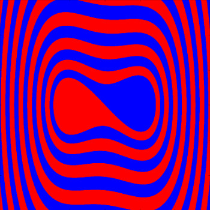

Determinizm a przewidywalność
=============================

Determinizm jest terminem wieloznacznym.  W odniesieniu do nauk przyrodniczych możemy mówić o tym że :

Każde zjawisko jest wyznaczone przez swoje przyczyny i całokształt warunków.
Każde zjawisko podlega prawidłowościom przyrody, które wyrażane są w postaci odpowiednich praw nauki.
Jeżeli dysponujemy odpowiednią wiedzą (o przyczynach,  prawidłowościach), to można (przynajmniej w zasadzie) przewidywać przyszły bieg zdarzeń.  Poznawcze znaczenie zasady przyczynowości  sprowadza się do możliwości przewidywania. Determinizm i indeterminizm  występują już w starożytnej filozofii przyrody. Demokryt twierdził, że nie ma w świecie zdarzeń przypadkowych, lecz „wszystko dzieje się wskutek konieczności". Determinizm  łączono z poglądem, że prawa przyrody mają charakter jednoznaczny. Okazało się jednak że wiele zjawisk podlega jedynie prawom statystycznym. Pogląd, że pewne zjawiska przyrody nie podlegają prawom jednoznacznym, ale jedynie statystycznym to indeterminizm .  Doniosła rola praw statystycznych w fizyce współczesnej wymaga rozszerzenia formuły determinizmu: każde zdarzenie podlega prawom przyrody jednoznacznym (determinizm jednoznaczny, mocny) bądź statystycznym (determinizm probabilistyczny, umiarkowany). Wówczas indeterminizm (umiarkowany) mieści się w ramach determinizmu  w szerszym ujęciu. Wydawało się, że w mechanice, stworzonej przez Galileusza i Newtona, znając położenie i prędkość (lub położenie i pęd) ciała materialnego można przewidzieć cały przyszły ruch tego ciała (a więc podać położenie i pęd w każdej chwili późniejszej), a także ustalić, jaki był ruch tego ciała w przeszłości. Wszystko to jest słuszne  przy założeniu, że znane są  wszystkie siły działające na ciało w przeszłości i w przyszłości. Wynikało to z twierdzeń matematycznych o jednoznaczności rozwiązań równań różniczkowych, a takimi są równania Newtona. 

Jednakże historia pokazała, że  w fizyce klasycznej są znane teorie statystyczne, niedeterministyczne.  Rozważmy dla przykładu  gaz zamknięty w jakimś naczyniu. Wiemy, że w warunkach równowagi termodynamicznej dwie równe co do objętości części tego naczynia będą zawierać jednakową liczbę cząsteczek gazu. Nie wiemy jednak, które cząsteczki znajdą się w której z dwu połówek naczynia. Sytuacja pozornie przypomina prawo rozpadu: można podać taki czas, w którym rozpadnie się połowa atomów, i w ten sposób podzielić wszystkie atomy na dwie równe części - te, które się w tym czasie rozpadną, i te, które się nie rozpadną, podobnie jak podzieliliśmy cząsteczki gazu według kryterium, w której połowie naczynia się znajdują. W klasycznej fizyce statystycznej znamy prawa rządzące zachowaniem pojedynczych cząsteczek (są nimi z założenia prawa mechaniki newtonowskiej), a nasza niewiedza co do tego zachowania jest spowodowana po pierwsze niemożliwością śledzenia ruchu wielu miliardów obiektów, a po drugie, brakiem potrzeby, aby to czynić: wystarczy nam znać właśnie tylko pewne wielkości średnie, które ujawniają się fenomenologicznie, na przykład jako temperatura gazu, czy też jego ciśnienie. Tak więc rzeczywisty kompletny opis stanu gazu musiałby zawierać informację dotyczącą N wektorów położenia i N wektorów pędu (N - liczba cząsteczek gazu), co jest liczbą ogromną, podczas gdy opis statystyczny ogranicza się do kilku potrzebnych liczb. Opis statystyczny odnosi się do ogromnej liczby cząstek i jest to opis oparty o teorię prawdopodobieństwa i teorię procesów stochastycznych. Z definicji jest to opis niedeterministyczny. Ale jak powiedzieliśmy, opis jednej cząstki jest w pełni deterministyczny. Twierdzenia o jednoznaczności rozwiązań równań różniczkowych dawały nadzieję na totalny determinizm i przewidywalność ruchu pojedyńczych cząstek. Nadzieja ta z praktycznego punktu widzenia okazała się mrzonką.  W latach 50-tych XX wieku pokazano, że z praktycznego punktu widzenia determinizm mechaniki Newtona jest złudny i ugruntowana wiara w przewidywalność zachowania się prostych układów  mechanicznych  załamała się. Pojawiły się liczne przykłady, a później teoria matematyczna, pokazujące  niemożliwość przewidywania czasowej ewolucji prostych układów mechanicznych. Podkreślamy, że chodzi tu o praktyczne aspekty przewidywalności. Z matematycznego punktu widzenia, przewidywalność jest ciągle słuszna.  Dobitnym przykładem nieprzewidywaloności w praktyce jest prognoza pogody, co udowadnia codzienne życie. Poniżej przedstawimy zagadnienia, które ukażą nam, co oznacza nieprzewidywalność w teorii deterministycznej. Pokażemy, dlaczego ewolucja określona przez determinizm równań Newtona jest nieprzewidywalna. Ta deterministyczna nieprzewidywalność ma swoją nazwę: deterministyczny chaos. 

Model chaosu. Układ bistabilny (oscylator Duffinga)
===================================================

Aby dobrze zrozumieć istotę chaotycznego zachowania się układów dynamicznych, posłużymy się prostym przykładem z mechaniki klasycznej Newtona. Rozpatrujemy jednowymiarowy ruch cząstki wzdłuż osi OX opisany równaniem Newtona:

.. MATH::
    :label: eqn1

    m \ddot x = F(x, \dot x, t) =ax - bx^3 - \gamma \dot x + A \cos(\Omega t), \qquad x(0) = x_0, \quad  \dot x(0) = v(0) = v_0

Model ten wydaje się być banalnie prosty.

jest to ruch cząstki w polu siły :math:`F(x) = ax-bx^3  (a, b > 0)`
jest to ruch tłumiony tarciem :math:`F(v) = - \gamma v = -\gamma \dot x` oraz 
na cząstkę działa siła periodyczna w czasie :math:`F(t) = A\cos(\Omega t)`. 
Zauważmy, że średnia wartość siły :math:`F(t)` na jednym okresie wynosi  zero, czyli średnio działa zerowa siła! Siła :math:`F(x) = x-x^3` to jest siła potencjalna. Dlatego warto wykreślić potencjał :math:`V(x)`  odpowiadający tej sile:

.. MATH::
    :label: eqn2

    V(x) = - \int F(x) dx = \frac{1}{4}  b x^4 - \frac{1}{2}  a x^2

Potencjał  ten nazywa się potencjałem bistabilnym i jest jednym z najważniejszych modelowych potencjałów w fizyce, począwszy od teorii Netwona, poprzez teorię przejść fazowych, teorię aktywacji  reakcji chemicznych, a na teorii cząstek elementarnych (mechanizm Higgsa) skończywszy. Poniżej pokazujemy wykres tego potencjału (mówiąc precyzyjnie: energii potencjalnej). 

Powyższe równanie Newtona  ma kilka realizacji.

1 Pierwszy przykład realizacji: Metalowa kulka zawieszona na nieważkim 
  pręcie w polu dwóch magnesów (które modelują bistabilny potencjał). 
  Na kulkę działa w kierunku poziomym periodyczne pole elektryczne 
  :math:`A\cos(\omega t)`. Układ ten jest przedstawiony na rysunku. 
  
  .. figure:: images/pendulum.png
     :align: center
     :alt: wahadło

     Przykład realizacji układu bistabilnego.

2 Drugi przykład realizacji: Obwód elektroniczny, który jest szczegółowo opisany w pracy:

  B. K. Jones and G. Trefan, Am. J. Phys. 69 (2001) str. 464.
  "The Duffing oscillator: A precise electronic analog chaos demonstrator 
  for the undergraduate laboratory "

.. sagecellserver::
    :is_verbatim: True

    sage: # Przeskalowany potencjał bistabilny: a=b=1
    sage: p = plot(0.25*x^4 - 0.5*x^2, (x,-1.6,1.6), figsize=(6,4), axes_labels=[r'$x$',r'$V(x)$'], color="blue")
    sage: p += text("$-x_s$",(-1,0.025),fontsize=16, color='black')
    sage: p += text("$x_s$",(1,0.025),fontsize=16, color='black')
    sage: p.show()

.. end of input

Skalowanie
----------

Układ opisany powyżej zawiera 6 parametrów. Część parametrów można wyeliminować poprzez przeskalowanie równania do postaci bezwymiarowej. Istnieje kilka  możliwości. Zwykle zaczynamy od skalowania czasu i położenia. Nowy bezwymiarowy czas :math:`\tau` ma postać:

.. MATH::
    :label: eqn3

    s = \frac{t}{\tau_0}, \qquad \tau_0^2 = \frac{m}{a}

Nowe bezwymiarowe położenie definiujemy jako

.. MATH::
    :label: eqn4

    X = \frac{x}{L}, \qquad L^2 = \frac{a}{b}

Wówczas bezwymiarowa postać równania ruchu jest następująca: 

.. MATH::
    :label: eqn5

    \ddot X = X - X^3 - \gamma_0 \dot X + A_0 \cos(\omega_0 s), \qquad X(0) = X_0, \quad  \dot X(0) = \dot X_0

Obecnie występują 3 przeskalowane parametry:

.. MATH::
    :label: eqn6

     \gamma_0  = \frac{\tau_0^2}{m L} \gamma, \qquad A_0 = \frac{\tau_0^2}{m L} A, \qquad \omega_0 = \tau_0 \Omega

W dalszej części będziemy posługiwali się tylko i wyłącznie przeskalowanym równaniem. Dlatego wygodnie będzie używać "starych" oznaczeń: Bedziemy analizowali równanie w postaci

.. MATH::
    :label: eqn7

    \ddot x = x - x^3 - \gamma \dot x + A \cos(\omega_0 t ), \qquad x(0) = x_0, \quad  \dot x(0) = \dot y_0 = v_0

gdzie przeskalowany potencjał

.. MATH::
    :label: eqn7a

    V(x) = - \int F(x) dx = \frac{1}{4} x^4 - \frac{1}{2} x^2

Przeskalowane równanie jest w takiej postaci, że przyjmujemy wartości parametrów :math:`m=1,  a=1,  b=1`.

Krok 1. Układ zachowawczy
-------------------------

W pierwszym  kroku rozpatrujemy najprostszy przypadek (pamiętajmy o przeskalowanej postaci, w której masa cząstki :math:`m=1`)):

.. MATH::
    :label: eqn8

    \ddot x = x - x^3 = - V'(x), \qquad x(0) = x_0, \quad  \dot x(0) = v(0) =  v_0

Jest on równoważny układowi 2 równań różniczkowych, autonomicznych, pierwszego rzędu:

.. MATH::
    :label: eqn9

    \dot x = v, \qquad x(0) = x_0,

    \dot v = x - x^3, \qquad v(0) = v_0.

Oznacza to, że przestrzeń fazowa jest 2-wymiarowa.

Taki przypadek był już rozpatrywany: jest to układ zachowawczy o jednym stopniu swobody. Istnieje jedna stała ruchu (jedna całka ruchu), a mianowicie całkowita energia układu:

.. MATH::
    :label: eqn10

    \frac{1}{2} \dot x^2(t) + V(x(t)) = const. = E  = E_k + E_p = \frac{1}{2} \dot x^2(0) + V(x(0)) = \frac{1}{2}  v_0^2 + V(x_0)

na którą składa się energia kinetyczna :math:`E_k` oraz energia potencjalna :math:`E_p`.  Stała :math:`E` jest określona przez warunki początkowe :math:`x(0) = x_0` oraz :math:`v(0) = v_0`.  Ponieważ jest zachowana całkowita energia układu, ruch jest periodyczny. Nie istnieją atraktory i nie istnieją  asymptotycznie stabilne stany stacjonarne. Krzywe fazowe są zamknięte co oznacza że  cząstka porusza się periodycznie w czasie. W zależności od warunków początkowych, amplituda dragań jest większa lub mniejsza, ponieważ warunki początkowe wyznaczają wartość stałej ruchu :math:`E`. Jeżeli dwa warunki początkowe :math:`(x_{01}, v_{01})`  oraz  :math:`(x_{02}, v_{02})` nieznacznie się różnią, np. w sensie odległości: 

.. MATH::
    :label: eqn11

    | [x_{01}^2 +  v_{01}^2] - [x_{02}^2 +  v_{02}^2] | << 1

to krzywe fazowe nieznacznie się różnią i ruch cząstki dla tych dwóch warunków początkowych nieznacznie się różni. Mówimy wówczas, że układ jest nieczuły na zmianę warunków początkowych.  Jak widać z powyższego wzoru, dwa różne warunki początkowe oznaczają, że układ ma dwie różne energie :math:`E`. To z kolei oznacza, że częstości ruchu periodycznego także będą różne.  Różnica częstości powoduje, że cząstki  będą się powoli oddalać od siebie, ale tempo oddalania będzie liniowe w czasie.  Gdyby tempo oddalania było znacznie szybsze, a mianowicie rosło eksponencjalnie w czasie, zachowanie takie nazwalibyśmy chaotycznym.  Do tego problemu powrócimy poniżej, ponieważ jest on kluczowym dla zrozumienia chaotycznego zachowania się układu.

Poniżej przedstawiamy potencjał i  krzywe fazowe dla tego przypadku.

.. sagecellserver::
    :is_verbatim: True

    sage: #parametry dla wizualizacji
    sage: var('x v')
    sage: x0 = 1.5
    sage: v0 = 0.2
    sage: E = 0.25*x0^4 - 0.5*x0^2 + v0^2
    sage: #
    sage: #prawo zachowania energii
    sage: V=0.25*x^4 - 0.5*x^2
    sage: PZE = v^2 + V == E
    sage: #
    sage: #wychylenia ekstremalne
    sage: print "ekstremalne wychylenia dla (x0,v0) = (%.2f,%.2f)"%(x0,v0)
    sage: rozw = solve(PZE(v=0), x); show(rozw)
    sage: xmin = min([i.rhs() for i in rozw if imag(i.rhs()) == 0])
    sage: xmax = max([i.rhs() for i in rozw if imag(i.rhs()) == 0])
    sage: #
    sage: #i jego rozwiązanie
    sage: print "ekstremalne prędkości dla (x0,v0) = (%.2f,%.2f)"%(x0,v0)
    sage: rozw = solve(PZE, v); show(rozw)
    sage: v1=rozw[0].rhs()
    sage: v2=rozw[1].rhs()
    sage: vmax = abs(v1(x=0))
    sage: #
    sage: #krzywe fazowe
    sage: start_point = (x0,V(x=x0))
    sage: p0 = point(start_point,size=30) + text(r"$  x_0$",start_point,vertical_alignment='bottom',horizontal_alignment='left')
    sage: p1 = plot(V,(x,xmin,xmax))
    sage: p21 = plot(v1, (x,xmin,xmax), color='red')
    sage: p22 = plot(v2, (x,xmin,xmax), color='green')
    sage: (p0+p1).show(figsize=4)
    sage: (p21+p22).show(figsize=4)

.. end of input

Krok 2. Układ dysypatywny czyli wpływ tarcia.
---------------------------------------------

W drugim  kroku dodajemy tarcie i rozpatrujemy równanie ruchu w postaci:

.. MATH::
    :label: eqn12

    \ddot x =  x - x^3 -\gamma \dot x , \qquad x(0) = x_0, \quad  \dot x(0) = v(0) =  v_0

Jest on równoważny układowi 2 równań różniczkowych, autonomicznych, pierwszego rzędu:

.. MATH::
    :label: eqn13

    \dot x = v, \qquad x(0) = x_0, 
    
    \dot v = x - x^3 -\gamma v , \qquad v(0) = v_0.

Oznacza to, że przestrzeń fazowa jest 2-wymiarowa.

Taki przypadek był także rozpatrywany: jest to układ dysypatywny o jednym stopniu swobody. Nie istnieje już stała ruchu :math:`E`.  Całkowita energia układu maleje w czasie.  W tym układzie  istnieją 3 stany stacjonarne. Stany te określone są przez równanie:

.. MATH::
    :label: eqn14

    x-x^3=0, \qquad \mbox{stąd} \qquad x_{s0}=0, \quad x_{s1} = 1, \quad x_{s2} = -1

Stany stacjonarne :math:`x_{s1} = 1` oraz :math:`x_{s2} = -1`  są  stabilne. Stan :math:`x_{s0}=0` jest niestabilny. Istnieją 2 atraktory  :math:`A_1= x_{s1} = 1` oraz :math:`A_2= x_{s2} = -1` i  2 obszary przyciągania :math:`B(A_1)` oraz :math:`B(A_2)`, których suma mnogościowa :math:`B(A_1) \cup  B(A_2) = R^2` jest całą płaszczyzną.  Krzywe fazowe  zawsze dążą do jednego z atraktorów lub do niestabilnego stanu stacjonarnego. Jeżeli dwa warunki początkowe :math:`(x_{01}, v_{01})`  oraz  :math:`(x_{02}, v_{02})` nieznacznie się różnią np. w sensie odległości: 

.. MATH::
    :label: eqn15

    | [x_{01}^2 +  v_{01}^2] - [x_{02}^2 +  v_{02}^2] | << 1

i są w tym samym obszarze przyciągania, to krzywe fazowe nieznacznie się różnią i ruch cząstki dla tych dwóch warunków początkowych nieznacznie się różni. Mówimy wówczas, że układ jest nieczuły na zmianę warunków początkowych. Natomiast jeżeli dwa warunki początkowe :math:`(x_{01}, v_{01}) \in B(A_1)`  oraz  :math:`(x_{02}, v_{02}) \in B(A_2)` nieznacznie się różnią, ale są w dwóch obszarach przyciągania :math:`B(A_1)` oraz :math:`B(A_2)`, to trajektorie zaczną po pewnym czasie różnić się znacznie, będą przyciągane do dwóch różnych atraktorów  i będą dążyć  do dwóch różnych stanów stacjonarnych :math:` x_{s1} = 1` oraz :math:` x_{s2} = -1`. Tym niemniej, w takiej sytuacji mówimy, że układ jest nieczuły na zmianę warunków początkowych w sensie o którym mowa powyżej.

   Diagram basenów przyciągania dla potencjału bistabilnego

Kolor niebieski to obszar warunków początkowych które są "przyciągane"  do atraktora :math:`(1, 0)`, do prawego 
minimum potencjału. Kolor czerwony to obszar warunków początkowych które są "przyciągane"  do atraktora 
:math:`(-1, 0)`, do lewego minimum potencjału. W zależności od wartości stałej tłumienia :math:`\gamma`, diagram 
ten przybiera nieco inne kształty, ale struktura dwu-kolorowych pasów pozostaje. Brzeg obszarów przyciągania jest 
gładką krzywą, której wymiar wynosi 1. Jeżeli warunki początkowe są położone dokładnie na tym brzegu, to cząstka 
porusza się do niestabilnego stanu stacjonarnego :math:`(x=0, v=0)` (maksimum potencjału). 

.. sagecellserver::
    :is_verbatim: True

    sage: # wykresy dla przypadku z tłumieniem
    sage: var('x v')
    sage: x01, v01 = 1.50, 0
    sage: x02, v02 = 1.52, 0
    sage: #
    sage: # siła
    sage: F = x-x^3
    sage: V = -integrate(F,x)
    sage: #
    sage: # tarcie: parametr gamma
    sage: g = 0.1
    sage: #
    sage: # numeryczne rozwiazanie równań ruchu
    sage: T = srange(0,20*pi,0.01)
    sage: num1 = desolve_odeint(vector([v,F-g*v]), [x01,v01], T, [x,v])
    sage: num2 = desolve_odeint(vector([v,F-g*v]), [x02,v02], T, [x,v])
    sage: #
    sage: #krzywe fazowe
    sage: lt  = plot(V, (x, -max([abs(x01),abs(x02)]),max([abs(x01),abs(x02)])), color='black', figsize=4)
    sage: lt += point((x01,V(x=x01)), color='green', size=50, axes_labels=['$x$','$V(x)$'])
    sage: lt += point((x02,V(x=x02)), color='red', size=50)
    sage: lb  = list_plot(num1.tolist(), plotjoined=1, color='green', axes_labels=['$x(t)$','$v(t)$'])
    sage: lb += list_plot(num2.tolist(), plotjoined=1, color='red', figsize=4)
    sage: rt  = list_plot(zip(T,num1[:,0].tolist()), plotjoined=1, color='green', axes_labels=['$t$','$x(t)$'])
    sage: rt += list_plot(zip(T,num2[:,0].tolist()), plotjoined=1, color='red', figsize=4)
    sage: rb  = list_plot(zip(T,num1[:,1].tolist()), plotjoined=1, color='green', axes_labels=['$t$','$v(t)$'])
    sage: rb += list_plot(zip(T,num2[:,1].tolist()), plotjoined=1, color='red', figsize=4)
    sage: #
    sage: html("""
    sage: 
rozwiązania z warunkami początkowymi
    sage: ($x_{01},v_{01}$)=(%.2f,%.2f)
    sage: ($x_{02},v_{02}$)=(%.2f,%.2f)
    sage: dążą do tego samego atraktora: 
    sage: (x,v)=(-1,0)
    sage: 

    sage: """%(x01,v01,x02,v02))
    sage: html.table([[lt,rt],[lb,rb]])

.. end of input

Na powyższym zestawie rysunków,  2 warunki początkowe leżą w tym samym obszarze  przyciągania  atraktora :math:`(-1, 0)`. Oznacza to, że 2 warunki początkowe są umiejscowione w czerwonym obszarze na diagramie basenów przyciągania pokazanym powyżej. Układ nie jest czuły na zmianę warunków początkowych, gdy leżą one w tym samym basenie przyciągania.

.. sagecellserver::
    :is_verbatim: True

    sage: # wykresy dla przypadku z tłumieniem
    sage: var('x v')
    sage: x01, v01 = 1.58, 0
    sage: x02, v02 = 1.57, 0
    sage: #
    sage: # siła
    sage: F = x-x^3
    sage: V = -integrate(F,x)
    sage: #
    sage: # tarcie: parametr gamma
    sage: g = 0.1
    sage: #
    sage: # numeryczne rozwiazanie równań ruchu
    sage: T = srange(0,20*pi,0.01)
    sage: num1 = desolve_odeint(vector([v,F-g*v]), [x01,v01], T, [x,v])
    sage: num2 = desolve_odeint(vector([v,F-g*v]), [x02,v02], T, [x,v])
    sage: #
    sage: # wykresy funkcji
    sage: lt  = plot(V, (x, -max([abs(x01),abs(x02)]),max([abs(x01),abs(x02)])),color='black',  figsize=4)
    sage: lt += point((x01,V(x=x01)), color='blue', size=50, axes_labels=['$x$','$V(x)$'])
    sage: lt += point((x02,V(x=x02)), color='red', size=50)
    sage: lb  = list_plot(num1.tolist(), plotjoined=1, color='blue', axes_labels=['$x(t)$','$v(t)$'])
    sage: lb += list_plot(num2.tolist(), plotjoined=1, color='red', figsize=4)
    sage: rt  = list_plot(zip(T,num1[:,0].tolist()), plotjoined=1, color='blue', axes_labels=['$t$','$x(t)$'])
    sage: rt += list_plot(zip(T,num2[:,0].tolist()), plotjoined=1, color='red', figsize=4)
    sage: rb  = list_plot(zip(T,num1[:,1].tolist()), plotjoined=1, color='blue', axes_labels=['$t$','$v(t)$'])
    sage: rb += list_plot(zip(T,num2[:,1].tolist()), plotjoined=1, color='red', figsize=4)
    sage: #
    sage: html("""
    sage: 
rozwiązania z warunkami początkowymi
    sage: ($x_{01},v_{01}$)=(%.2f,%.2f)
    sage: ($x_{02},v_{02}$)=(%.2f,%.2f)
    sage: dążą do różnych atraktorów: 
    sage: (x,v)=(1,0)
    sage: (x,v)=(-1,0)
    sage: 

    sage: """%(x01,v01,x02,v02))
    sage: html.table([[lt,rt],[lb,rb]])

.. end of input

Na powyższym zestawie rysunków,  2 warunki początkowe leżą w dwóch różnych obszarach  przyciągania.  Oznacza to, że 1 warunek  początkowy leży w  niebieskim obszarze na diagramie basenów przyciągania, natomiast  2 warunek  początkowy leży w  czerwonym obszarze na diagramie basenów przyciągania. Te dwa warunki początkowe leżą blisko brzegu 2 basenów przyciągania. Dlatego układ jest czuły na zmianę warunków początkowych, pod warunkiem że leżą one w dwóch różnych basenach przyciągania. Ale to nie jest jeszcze kryterium własności chaotyczych układu.

Krok 3. Układ z tarciem i periodyczną siłą.
-------------------------------------------

W trzecim kroku dodajemy siłę periodyczną w czasie  i rozpatrujemy równanie ruchu w wyjściowej pełnej postaci:

.. MATH::
    :label: eqn16

    \ddot x =  x - x^3 -\gamma \dot x  +  A \cos (\omega_0 t) , \qquad x(0) = x_0, \quad  \dot x(0) = v(0) =  v_0

Jest on równoważny układowi 3 równań różniczkowych, autonomicznych, pierwszego rzędu:

.. MATH::
    :label: eqn17

    \dot x = v, \qquad x(0) = x_0,
    
    \dot v = x - x^3 -\gamma v + A \cos z , \qquad v(0) = v_0, 
    
    z = \omega_0, \qquad z(0) = 0.

Oznacza to, że przestrzeń fazowa jest 3-wymiarowa.

Matematycy wolą przepisać powyższy układ równań dla "tradycyjnych"  3 zmiennych :math:`(x, y, z)` w postaci:

.. MATH::
    :label: eqn18

    \dot x = y, \qquad x(0) = x_0, 
    
    \dot y = x - x^3 -\gamma y + A \cos z , \qquad y(0) = y_0, 
    
    z = \omega_0, \qquad z(0) = 0.

czyli prędkość cząstki :math:`v` jest teraz oznaczona jako :math:`v=y`.

Okazuje się, że pełny układ wykazuje radykalnie inne własności od poprzednich 2 przypadków. Z punktu widzenia fizyki mamy taki oto proces:  Cząstka porusza się w bistabilnym potencjale. Ponieważ potencjał dąży do nieskończoności gdy położenie dąży do nieskończoności, ruch cząstki jest ograniczony; cząstka jest uwięziona w potencjale i nie może uciec do nieskończoności. Siła tarcia pcha cząstkę do jednego ze ("starych") stanów stacjonarnych  :math:`x_{s1}`  lub :math:`x_{s2}`. Z kolei zewnętrzna siła periodyczna w czasie pompuje energię do układu i przeciwdziała sile tarcia. Cząstka już nie dąży do stanu stacjonarnego, nie zatrzyma się dla długich czasów ale będzie  ciągle poruszać się i nigdy już nie spocznie. Istotne stają się efekty inercjalne związane z masą czastki, które są odzwierciedlone w wyrazie :math:`\dot y`, czyli przyśpieszeniu cząstki. Istotne jest to, że nie jest to ruch przetłumiony. W konsekwencji układ nie posiada stanu stacjonarnego w postaci punktu w przestrzeni fazowej jak to było w przypadku 2. Wszystkie te powyższe czynniki stają się istotne dla zrozumienia  skomplikowanych i złożonych własności ewolucji cząstki. 

.. sagecellserver::
    :is_verbatim: True

    sage: # przykładowa trajektoria  (górny wykres)
    sage: # wraz z krzywą fazową (dolny wykres)
    sage: var('x y z')
    sage: T = srange(0,150*pi,0.01)
    sage: sol=desolve_odeint( vector([y,x-x^3-0.26*y+0.3*cos(z), 1]), [0.1,0.1,0],T,[x,y,z])
    sage: t = line(zip(T,sol[:,0]), figsize=(12,4), axes_labels=["$t$","$x(t)$"], frame=1, axes=0)
    sage: b = line(zip(sol[:,0],sol[:,1]), figsize=(12,4), axes_labels=["$x(t)$","$v(t)$"], frame=1, axes=0)
    sage: html.table([[t],[b]])

.. end of input

Ruch periodyczny o okresie 1
----------------------------

W modelu występują 3 bezwymiarowe parametry: współczynnik tarcia :math:`\gamma`, amplituda zewnętrznej siły :math:`A` oraz częstość drgań :math:`\omega_0` siły periodycznej w czasie. Poniżej pokażemy kilka charakterystycznych trajektorii układu. Zaczniemy od prostej periodycznej ewolucji, ruchu okresowego o tzw. okresie 1.

Załóżmy następujące wartości parametrów:

.. MATH::
    :label: eqn19

    \gamma = 0.15, \qquad A = 0.3, \qquad \omega_0 = 1

W tym przypadku obserwujemy regularny ruch. Jeżeli nieco zaburzymy warunki początkowe, to nowy ruch jest także regularny (trzeba być ostrożnym, gdy mówimy "nieco zaburzymy").

.. sagecellserver::
    :is_verbatim: True

    sage: # wykresy dla przypadku z tłumieniem
    sage: var('x y z')
    sage: x0, y0, z0 = 0.1,0.1,0
    sage: kolor = 'green'
    sage: #
    sage: # siła
    sage: F = x-x^3
    sage: V = -integrate(F,x)
    sage: #
    sage: # tarcie: parametr gamma
    sage: g = 0.1
    sage: A = 0.3
    sage: w = 1
    sage: #
    sage: # układ różniczkowych równań ruchu
    sage: dx = y
    sage: dy = F - g*y + A*cos(z)
    sage: dz = w
    sage: #
    sage: # numeryczne rozwiazanie równań ruchu
    sage: T = srange(0,30*pi,0.01)
    sage: num = desolve_odeint(vector([dx,dy,dz]), [x0,y0,z0], T, [x,y,z])
    sage: #
    sage: # wykresy funkcji
    sage: xmin = 1.5
    sage: lt  = plot(V, (x,-xmin,xmin), figsize=4)
    sage: lt += point((x0,V(x=x0)), color=kolor, size=50, axes_labels=['$x$','$V(x)$'])
    sage: lb  = list_plot(zip(num[:,0],num[:,1]), plotjoined=1, color=kolor, axes_labels=['$x(t)$','$v(t)$'], figsize=4)
    sage: rt  = list_plot(zip(T,num[:,0].tolist()), plotjoined=1, color=kolor, axes_labels=['$t$','$x(t)$'], figsize=4)
    sage: rb  = list_plot(zip(T,num[:,1].tolist()), plotjoined=1, color=kolor, axes_labels=['$t$','$v(t)$'], figsize=4)
    sage: #
    sage: html("""Układ równań różniczkowych
    sage: $\dot{x} = %s$
    sage: $\dot{y} = %s$
    sage: $\dot{z} = %s$
    sage: z warunkami początkowymi
    sage: $(x_0,y_0,z_0) = (%.2f,%.2f,%.2f)$
    sage: """%(dx,dy,dz,x0,y0,z0))
    sage: html.table([[lt,rt],[lb,rb]])

.. end of input

Przyjrzyjmy sie teraz dwóm trajektoriom startującym z bliskich warunków początkowych. Rozpatrzmy ich początkową i asymptotyczną (dla długich czasów) ewolucję.

.. sagecellserver::
    :is_verbatim: True

    sage: # wykresy dla przypadku z tłumieniem
    sage: var('x y z')
    sage: x01, y01, z01 = 0.1,0.1,0
    sage: x02, y02, z02 = 0.11,0.1,0
    sage: #
    sage: # siła
    sage: F = x-x^3
    sage: V = -integrate(F,x)
    sage: #
    sage: # tarcie: parametr gamma
    sage: g = 0.1
    sage: A = 0.3
    sage: w = 1
    sage: #
    sage: # układ różniczkowych równań ruchu
    sage: dx = y
    sage: dy = F - g*y + A*cos(z)
    sage: dz = w
    sage: #
    sage: # numeryczne rozwiazanie równań ruchu
    sage: T = srange(0,200*pi,0.01)
    sage: num1 = desolve_odeint(vector([dx,dy,dz]), [x01,y01,z01], T, [x,y,z])
    sage: num2 = desolve_odeint(vector([dx,dy,dz]), [x02,y02,z02], T, [x,y,z])
    sage: #
    sage: lnum = int(len(num1[:,0])/10)
    sage: trans1 = num1[:lnum]
    sage: asymp1 = num1[-lnum:]
    sage: trans2 = num2[:lnum]
    sage: asymp2 = num2[-lnum:]
    sage: #
    sage: # wykresy funkcji
    sage: lt = list_plot(zip(trans1[:,0],trans1[:,1]), plotjoined=1, color='green', axes_labels=['$x(t)$','$v(t)$'], figsize=4)
    sage: lt += list_plot(zip(trans2[:,0],trans2[:,1]), plotjoined=1, color='red')
    sage: rt = list_plot(zip(T[:lnum],trans1[:,0].tolist()), plotjoined=1, color='green', axes_labels=['$t$','$x(t)$'], figsize=4)
    sage: rt += list_plot(zip(T[:lnum],trans2[:,0].tolist()), plotjoined=1, color='red')
    sage: lb = list_plot(zip(asymp1[:,0],asymp1[:,1]), plotjoined=1, color='green', axes_labels=['$x(t)$','$v(t)$'], figsize=4)
    sage: lb += list_plot(zip(asymp2[:,0],asymp2[:,1]), plotjoined=0, color='red')
    sage: rb = list_plot(zip(T[-lnum:],asymp1[:,0].tolist()), plotjoined=1, color='green', axes_labels=['$t$','$x(t)$'], figsize=4)
    sage: rb += list_plot(zip(T[-lnum:],asymp2[:,0].tolist()), plotjoined=1, color='red')
    sage: #
    sage: html("""Układ równań różniczkowych
    sage: $\dot{x} = %s$
    sage: $\dot{y} = %s$
    sage: $\dot{z} = %s$
    sage: z różnymi warunkami początkowymi
    sage: $(x_{01},y_{01},z_{01}) = (%.2f,%.2f,%.2f)$
    sage: $(x_{02},y_{02},z_{02}) = (%.2f,%.2f,%.2f)$
    sage: """%(dx,dy,dz,x01,y01,z01,x02,y02,z02))
    sage: html.table([[lt,rt],[lb,rb]])

.. end of input

Na dwóch górnych diagramach przedstawioną reżim krótkich czasów. Ponieważ 2 warunki początkowe nieco się różnią, więc początkowa ewolucja nieco się różni. Kolor czerwony i zielony jest rozróżnialny na prawym górnym rysunku pokazującym ewolucję :math:`x(t)` dla krótkich czasów.  Jeżeli przyjrzymy się reżimowy długich czasów (dwa dolne diagramy) to zauważymy duże podobieństwo w ewolucji: krzywe fazowe są zamknięte więc jest to prosty ruch periodyczny, przypominający nieco zdeformowaną funkcję typu :math:`\sin(\alpha t)` czy też :math:`\cos(\alpha t)`. Jest to funkcja okresowa z charakterystycznym jednym jedynym  okresem :math:`T`. Dlatego mówimy, że jest ruch periodyczny o okresie 1. Dwie krzywe :math:`x(t)` na dolnym prawym rysunku nie są rozróżnialne. 

Można zrobić doświadczenie numeryczne i wybierać różne warunki początkowe. Zobaczymy, że trajektorie dążą do tego samego okresowego rozwiązania, są przyciagane do tego okresowego rozwiązania. Innymi słowy, ta krzywa fazowa o okresie 1  jest ATRAKTOREM.  Atraktor ten nazywa się periodycznym atraktorem o okresie 1 lub 1-okresowym  atraktorem. Można by postawić pytanie: jak wygląda basen przyciągania dla tego atraktora. Aby dać odpowiedź na to pytanie należy zbadać numerycznie np. kwadrat warunków początkowych  :math:`(x_0, y_0)` i wybrać te warunki początkowe które dążą do powyższej krzywej fazowej o okresie 1. Okazuje się, że basen przyciągania jest "porządnym" zbiorem, którego brzeg jest gładką krzywą, podobnie jak w przypadku zilustrowanym powyżej dla układu tylko z tarciem, bez siły okresowej.

Ruch periodyczny o okresie 3
----------------------------

Załóżmy następujące wartości parametrów:

.. MATH::
    :label: eqn20

    \gamma = 0.22, \qquad A = 0.3, \qquad \omega_0 = 1

W tym przypadku obserwujemy także periodyczny ruch, ale nieco bardziej skomplikowany. Nie jest to prosty periodyczny ruch, ale tzw. ruch o okresie 3, tzn. teraz okres jest 3 razy dłuższy niż w poprzednim przypadku.

.. sagecellserver::
    :is_verbatim: True

    sage: # wykresy dla przypadku z tłumieniem
    sage: var('x y z')
    sage: x0, y0, z0 = 0.1,0.1,0
    sage: kolor = 'red'
    sage: #
    sage: # siła
    sage: F = x-x^3
    sage: V = -integrate(F,x)
    sage: #
    sage: # tarcie: parametr gamma
    sage: g = 0.22
    sage: A = 0.3
    sage: w = 1
    sage: #
    sage: # układ różniczkowych równań ruchu
    sage: dx = y
    sage: dy = F - g*y + A*cos(z)
    sage: dz = w
    sage: #
    sage: # numeryczne rozwiazanie równań ruchu
    sage: T = srange(0,20*pi,0.01)
    sage: num = desolve_odeint(vector([dx,dy,dz]), [x0,y0,z0], T, [x,y,z])
    sage: #
    sage: # wykresy funkcji
    sage: xmin = 1.5
    sage: lt  = plot(V, (x,-xmin,xmin), figsize=4)
    sage: lt += point((x0,V(x=x0)), color=kolor, size=50, axes_labels=['$x$','$V(x)$'])
    sage: lb  = list_plot(zip(num[:,0],num[:,1]), plotjoined=1, color=kolor, axes_labels=['$x(t)$','$v(t)$'], figsize=4)
    sage: rt  = list_plot(zip(T,num[:,0].tolist()), plotjoined=1, color=kolor, axes_labels=['$t$','$x(t)$'], figsize=4)
    sage: rb  = list_plot(zip(T,num[:,1].tolist()), plotjoined=1, color=kolor, axes_labels=['$t$','$v(t)$'], figsize=4)
    sage: #
    sage: html("""Układ równań różniczkowych
    sage: $\dot{x} = %s$
    sage: $\dot{y} = %s$
    sage: $\dot{z} = %s$
    sage: z warunkami początkowymi
    sage: $(x_0,y_0,z_0) = (%.2f,%.2f,%.2f)$
    sage: """%(dx,dy,dz,x0,y0,z0))
    sage: html.table([[lt,rt],[lb,rb]])

.. end of input

I znów zobaczymy, jak początkowa ewolucja różni się od tej po długim czasie.

.. sagecellserver::
    :is_verbatim: True

    sage: # wykresy dla przypadku z tłumieniem
    sage: var('x y z')
    sage: x01, y01, z01 = 0.10,0.1,0
    sage: x02, y02, z02 = 0.11,0.1,0
    sage: #
    sage: # siła
    sage: F = x-x^3
    sage: V = -integrate(F,x)
    sage: #
    sage: # tarcie: parametr gamma
    sage: g = 0.22
    sage: A = 0.3
    sage: w = 1
    sage: #
    sage: # układ różniczkowych równań ruchu
    sage: dx = y
    sage: dy = F - g*y + A*cos(z)
    sage: dz = w
    sage: #
    sage: # numeryczne rozwiazanie równań ruchu
    sage: T = srange(0,200*pi,0.01)
    sage: num1 = desolve_odeint(vector([dx,dy,dz]), [x01,y01,z01], T, [x,y,z])
    sage: num2 = desolve_odeint(vector([dx,dy,dz]), [x02,y02,z02], T, [x,y,z])
    sage: #
    sage: lnum = int(len(num1[:,0])/10)
    sage: trans1 = num1[:lnum]
    sage: asymp1 = num1[-lnum:]
    sage: trans2 = num2[:lnum]
    sage: asymp2 = num2[-lnum:]
    sage: #
    sage: # wykresy funkcji
    sage: lt = list_plot(zip(trans1[:,0],trans1[:,1]), plotjoined=1, color='green', axes_labels=['$x(t)$','$v(t)$'], figsize=4)
    sage: lt += list_plot(zip(trans2[:,0],trans2[:,1]), plotjoined=1, color='red')
    sage: rt = list_plot(zip(T[:lnum],trans1[:,0].tolist()), plotjoined=1, color='green', axes_labels=['$t$','$x(t)$'], figsize=4)
    sage: rt += list_plot(zip(T[:lnum],trans2[:,0].tolist()), plotjoined=1, color='red')
    sage: lb = list_plot(zip(asymp1[:,0],asymp1[:,1]), plotjoined=1, color='green', axes_labels=['$x(t)$','$v(t)$'], figsize=4)
    sage: lb += list_plot(zip(asymp2[:,0],asymp2[:,1]), plotjoined=0, color='red')
    sage: rb = list_plot(zip(T[-lnum:],asymp1[:,0].tolist()), plotjoined=1, color='green', axes_labels=['$t$','$x(t)$'], figsize=4)
    sage: rb += list_plot(zip(T[-lnum:],asymp2[:,0].tolist()), plotjoined=1, color='red')
    sage: #
    sage: html("""Układ równań różniczkowych
    sage: $\dot{x} = %s$
    sage: $\dot{y} = %s$
    sage: $\dot{z} = %s$
    sage: z różnymi warunkami początkowymi
    sage: $(x_{01},y_{01},z_{01}) = (%.2f,%.2f,%.2f)$
    sage: $(x_{02},y_{02},z_{02}) = (%.2f,%.2f,%.2f)$
    sage: """%(dx,dy,dz,x01,y01,z01,x02,y02,z02))
    sage: html.table([[lt,rt],[lb,rb]])

.. end of input

Dla długich czasów, krzywe fazowe są zamknięte, ale nie są  to krzywe typu zdeformowana elipsa.  To są krzywe z 2 pętelkami. Tym niemniej, ruch jest periodyczny.

Podobnie jak poprzednim przypadku, można zrobić doświadczenie numeryczne i wybierać różne warunki początkowe. Zobaczymy, że wiele trajektorii dąży do tej samej  okresowej orbity, są one  przyciagane do tej  zamkniętek krzywej fazowej. Innymi słowy, ta krzywa fazowa o okresie 3  jest ATRAKTOREM.  Atraktor ten nazywa się periodycznym atraktorem o okresie 3 lub 3-okresowym  atraktorem.  Basen przyciągania dla tego atraktora  na płaszczyźnie warunków początkowych :math:`(x_0, y_0)`  jest "porządnym" zbiorem o wymiarze 2 (czyli kawałek płaszczyzny), którego brzeg jest gładką krzywą.

Ruch chaotyczny
---------------

Załóżmy następujące wartości parametrów:

.. MATH::
    :label: eqn21

    \gamma = 0.25, \qquad A = 0.3, \qquad \omega_0 = 1

W tym przypadku obserwujemy ruch, który wydaje się być wyjątkowo nieregularny, chaotyczny.

.. sagecellserver::
    :is_verbatim: True

    sage: # wykresy dla przypadku chaotycznego
    sage: var('x y z')
    sage: x0, y0, z0 = 0.1,0.1,0
    sage: kolor = 'firebrick'
    sage: #
    sage: # siła
    sage: F = x-x^3
    sage: V = -integrate(F,x)
    sage: #
    sage: # tarcie: parametr gamma
    sage: g = 0.25
    sage: A = 0.3
    sage: w = 1
    sage: #
    sage: # układ różniczkowych równań ruchu
    sage: dx = y
    sage: dy = F - g*y + A*cos(z)
    sage: dz = w
    sage: #
    sage: # numeryczne rozwiazanie równań ruchu
    sage: T = srange(0,50*pi,0.01)
    sage: num = desolve_odeint(vector([dx,dy,dz]), [x0,y0,z0], T, [x,y,z])
    sage: #
    sage: # wykresy funkcji
    sage: xmin = 1.5
    sage: lt  = plot(V, (x,-xmin,xmin), figsize=4)
    sage: lt += point((x0,V(x=x0)), color=kolor, size=50, axes_labels=['$x$','$V(x)$'])
    sage: lb  = list_plot(zip(num[:,0],num[:,1]), plotjoined=1, color=kolor, axes_labels=['$x(t)$','$v(t)$'], figsize=4)
    sage: rt  = list_plot(zip(T,num[:,0].tolist()), plotjoined=1, color=kolor, axes_labels=['$t$','$x(t)$'], figsize=4)
    sage: rb  = list_plot(zip(T,num[:,1].tolist()), plotjoined=1, color=kolor, axes_labels=['$t$','$v(t)$'], figsize=4)
    sage: #
    sage: html("""Układ równań różniczkowych
    sage: $\dot{x} = %s$
    sage: $\dot{y} = %s$
    sage: $\dot{z} = %s$
    sage: z warunkami początkowymi
    sage: $(x_0,y_0,z_0) = (%.2f,%.2f,%.2f)$
    sage: """%(dx,dy,dz,x0,y0,z0))
    sage: html.table([[lt,rt],[lb,rb]])

.. end of input

Zobaczmy, jak tym razem ewoluują rozwiązania o 2 bliskich warunkach początkowych.

.. sagecellserver::
    :is_verbatim: True

    sage: var('x y z')
    sage: x01, y01, z01 = 0.1,0.1,0
    sage: x02, y02, z02 = 0.11,0.1,0
    sage: #
    sage: # siła
    sage: F = x-x^3
    sage: V = -integrate(F,x)
    sage: #
    sage: # tarcie: parametr gamma
    sage: g = 0.25
    sage: A = 0.3
    sage: w = 1
    sage: #
    sage: # układ różniczkowych równań ruchu
    sage: dx = y
    sage: dy = F - g*y + A*cos(z)
    sage: dz = w
    sage: #
    sage: # numeryczne rozwiazanie równań ruchu
    sage: T = srange(0,200*pi,0.01)
    sage: num1 = desolve_odeint(vector([dx,dy,dz]), [x01,y01,z01], T, [x,y,z])
    sage: num2 = desolve_odeint(vector([dx,dy,dz]), [x02,y02,z02], T, [x,y,z])
    sage: #
    sage: lnum = int(len(num1[:,0])/10)
    sage: trans1 = num1[:lnum]
    sage: asymp1 = num1[-lnum:]
    sage: trans2 = num2[:lnum]
    sage: asymp2 = num2[-lnum:]
    sage: #
    sage: # wykresy funkcji
    sage: lt = list_plot(zip(trans1[:,0],trans1[:,1]), plotjoined=1, color='green', axes_labels=['$x(t)$','$v(t)$'], figsize=4)
    sage: lt += list_plot(zip(trans2[:,0],trans2[:,1]), plotjoined=1, color='red')
    sage: rt = list_plot(zip(T[:lnum],trans1[:,0].tolist()), plotjoined=1, color='green', axes_labels=['$t$','$x(t)$'], figsize=4)
    sage: rt += list_plot(zip(T[:lnum],trans2[:,0].tolist()), plotjoined=1, color='red')
    sage: lb = list_plot(zip(asymp1[:,0],asymp1[:,1]), plotjoined=1, color='green', axes_labels=['$x(t)$','$v(t)$'], figsize=4)
    sage: lb += list_plot(zip(asymp2[:,0],asymp2[:,1]), plotjoined=1, color='red')
    sage: rb = list_plot(zip(T[-lnum:],asymp1[:,0].tolist()), plotjoined=1, color='green', axes_labels=['$t$','$x(t)$'], figsize=4)
    sage: rb += list_plot(zip(T[-lnum:],asymp2[:,0].tolist()), plotjoined=1, color='red')
    sage: #
    sage: html("""Układ równań różniczkowych
    sage: $\dot{x} = %s$
    sage: $\dot{y} = %s$
    sage: $\dot{z} = %s$
    sage: z różnymi warunkami początkowymi
    sage: $(x_{01},y_{01},z_{01}) = (%.2f,%.2f,%.2f)$
    sage: $(x_{02},y_{02},z_{02}) = (%.2f,%.2f,%.2f)$
    sage: """%(dx,dy,dz,x01,y01,z01,x02,y02,z02))
    sage: html.table([[lt,rt],[lb,rb]])

.. end of input

Początkowa ewolucja dwóch rozwiązań jest nierozróżnialna (ponieważ 2 warunki początkowe są bardzo blisko siebie). Po pewnym charakterystycznym czasie, zwanym czasem Lapunowa, trajektorie zaczynają różnić się coraz bardziej, zaczynają rozbiegać się: patrz trajektoria czerwona i zielona na dolnym prawym rysunku.

   Schematyczne trajektorie w reżimie chaotycznym.

W reżimie chaotycznym, te dwie trajektorie oddalają się od siebie w eksponencjalnie szybkim tempie określonym przez zależność:

.. MATH::
    :label: eqn22

    |x_1(t) - x_2(t)| = |x_1(0) - x_2(0)|\mbox{e}^{\lambda t}, \qquad \lambda > 0

lub

.. MATH::
    :label: eqn23

    |\Delta x(t)| = |\Delta x_0|\mbox{e}^{\lambda t}, \qquad \lambda > 0

gdzie :math:`\lambda` nazywa sie wykładnikiem Lapunowa.

Różnice w ewolucji stają się zbyt duże i pojawia się dylemat: która trajektoria jest właściwa, skoro nasza aparatura nie rozróżnia bliskich warunków początkowych. Determinizm staje się złudnym. Nie możemy przewidywać właściwej ewolucji układu.

Przedstawiony powyżej reżim chaotyczny nie jest jedyny. W układzie istnieje wiele takich wartości parametrów :math:`(\gamma, A, \omega)`, dla których pojawia się ruch chaotyczny. Należy nadmienić, że dla długich czasów  wiele trajektorii generowanych przez różne warunki początkowe zachowuje się bardzo podobnie, wiele trajektorii jest przyciąganych. Tu także istnieje atraktor i jego basen przyciągania. Jednakże ten atraktor jest dziwny: jego wymiar nie jest liczbą całkowitą i atraktor  jest fraktalem. Dlatego nazywa się dziwnym atraktorem.  Brzeg basenu przyciągania tego atraktora też ma dziwną strukturę  i jego wymiar jest fraktalny.

.. topic:: Zadania

  1) Niech :math:`\gamma = 0.1, \quad \omega_0 =1.4 , \quad (x_0, y_0, z_0) = (-0.5, -0.2, 0)`. 
     Zmieniaj parametr :math:`A=0.1,  0.32,  0.338,  0.35`.

     Obserwuj scenariusz  podwojenia okresu: 

     (i) pojawia się atraktor periodyczny o okresie 1.

     (ii) pojawia się atraktor periodyczny o okresie 2.

     (iii) pojawia się atraktor periodyczny o okresie 4.

     (iv) pojawia się atraktor periodyczny o okresie 8 (trudno  trafić). 

     (v) pojawia się ruch nieregularny, chaotyczny. 

  2) Zbadaj zachowanie się układu dla następujących wartości parametrów: 
     :math:`\gamma = 1.35  -  1.38, \quad A=1, \quad \omega_0 =1, \quad (x_0, y_0, z_0) = (0.0, 0.5, 0)`. 

  3) To samo dla wartości 
     :math:`\gamma = 0.5, \quad A=0.34875, \quad \omega_0 =1, \quad (x_0, y_0, z_0) = (0,  0, 0)`

