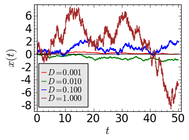
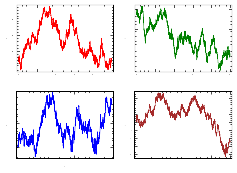
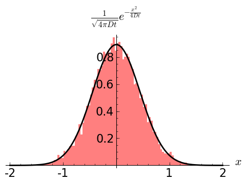
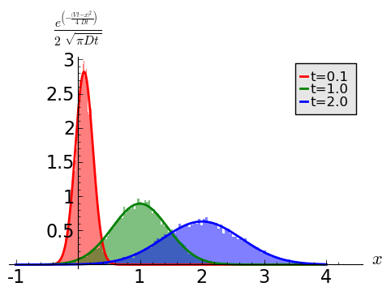

Stochastyczne równania różniczkowe
==================================

Stochastyczne równania różniczkowe (SDE, od angielskiej nazwy Stochastic differential equations)
są obecnie uważane za standardowe narzędzie wykorzystywane do analizy niektórych wielkości opisujących
dynamikę rynków finansowych. Do tych wielkości należą ceny aktywów, stopy procentowe czy ich pochodne. 
W przeciwieństwie do zwyczajnych równań różniczkowych, które posiadają jendoznaczne rozwiązanie, 
rozwiązaniami SDE są ciągłe w czasie procesy stochastyczne. Metody komputerowe wykorzystywane do analizy 
SDE bazują na klasycznych metodach wykorzystywanych do rozwiązywania tradycyjnych, deterministycznych
równań różniczkowych, są jednak uogólnione tak, aby radzić sobie z procesami losowymi.

Zestaw zmiennych losowych :math:`X_t` indeksowanych liczbami rzeczywistymi `t` nazywamy procesem losowym
ciągłym (ze względu na czas). Każda *realizacja* procesu losowego to przypadkowa wartość zmiennej 
losowej :math:`X_t` dla każdego `t`, jest więc funkcją czasu. Co ciekawe, *każda* deterministyczna
funkcja :math:`f(t)` może być uważana za proces stochastyczny, którego wariancja znika. 

Najbardziej znanym przykładem procesu losowego szeroko występującego w modelach fizyki, chemii ale i
rynków finansowych jest *proces Wienera* :math:`W(t) = W_t`, ciągły proces stochastyczny posiadający 
nastepujące własności

#) jest to proces rzeczywisty,

#) startuje z zera (:math:`W_0 = 0`),

#) ma stacjonarne i niezależne przyrosty na nieprzekrywających się przedziałach,

#) jest procesem Gaussa o zerowej wartości średniej :math:`\langle W_t - W_s \rangle = 0`
   i wariancji przyrostów :math:`\langle [W_t - W_s]^2 \rangle = 2 D (t -s)`,

#) proces Wienera może być reprezentowany ciągłymi trajektoriami.

Wynika z tego, że dla każdej różnicy czasów `t - s` zmienna losowa :math:`W_t - W_s` jest zmienną losową 
gaussowską o zerowej wartości średniej i wariancji :math:`2D(t-s)`. Więc jego rozkład prawdopodobieństwa ma 
postać

.. math::

   f_{W_t - W_s}(x) = \frac{1}{\sqrt{2 \pi D (t - s)}} \exp \Big[ -\frac{x^2}{4D(t-s)} \Big].

Proces taki może być wyprowadzony jako proces graniczny błądzenia przypadkowego. Wystarczy tylko zbadać
granicę dla której wielkość skoku i czas pomiędzy skokami będą maleć do zera. Tak zdefiniowanym procesem
posługujemy się zwyczajowo, gdy podczas analizy probalmu pojawia się jakaś nieregularna siła czy zaburzenie
którego nie możemy opisać równaniami deterministycznymi.

Typowe dla rynków finansowych *równanie dyfuzji* może być modelowane przez równanie różniczkowe posiadające
część deterministyczną zwaną **dryftem** oraz część losową zwaną **dyfuzją**. Ta ostatnia jest bardzo często
reprezentowana właśnie przez proces Wienera. Możemy sobie napisać ogólne równanie

.. math:: 
 
   dX = a(t, X) dt + b(t,X) dW_t.

Jest to postać różniczkowa. W zwykłych równaniach różniczkowych zazwyczaj stosujemu pochodne :math:`dx/dt`. W
tym przypadku postać różniczkowa ma większy sens, jako, że wiele interesujących nas procesów losowych (jak
ruch Browna) są procesami ciągłymi aczkolwiek nie są różniczkowalne. Powyższe równanie nabiera większego 
sensu pod znakiem całki

.. math::

   X(t) = X(0) + \int_0^t a(s,y) ds \int_0^t b(s,y) dW_s.

Ostatni wyraz z prawej zwany jest całką Ito. 

Równanie Blacka-Scholesa
------------------------

Jednym z bardziej znanych, historycznym już równaniem stochastycznym, jest równanie opisujące geometryczny
ruch Browna

.. math::

   dX = \mu X dt + \sigma X dW_t,

gdzie :math:`\mu, \sigma` to wielkości stałe.
Równanie to jest jednym z podstawowych elementów modelu wyceny opcji Blacka-Scholesa. Teoria ta została 
nagrodzona Nagrodą Nobla z ekonomii w roku 1997, a opracowana przez absolwenta fizyki i doktora matematyki 
Fischera Blacka oraz ekonomistę Myrona Scholesa. Teoria Blacka-Scholesa pozwala na wycenę wartości tzw. 
finansowych instrumentów pochodnych, czyli opcji, oraz służy do optymalizacji "bezpiecznego" portfela 
inwestycyjnego.

Pomimo tego, że równanie to wygląda na proste, żeby nie powiedzieć zbyt proste na to by opisywać jakąkolwiek
rzeczywistość na rynkach finansowych, ma ono olbrzymie znaczenie, jako, że może być rozwiązane ściśle
dając wynikowy wzór z którego możemy wyliczyć zmianę cen prostych opcji. Jak już powiedzieliśmy, 
rozwiązanie jest geometrycznym ruchem Browna

.. math:: 

   X(t) = X_0 \exp \Big[ \Big( \mu - \frac{\sigma^2}{2} \Big) t + \sigma dW_t \Big].

Dzięki zamkniętej postaci rozwiązania mamy możliwość testowania metod numerycznych, które przedstawimy
poniżej.

Schemat Eulera-Maruyamy
-----------------------

Najprostszą metodą numerycznego rozwiązywania równań różniczkowych zwyczajnych jest metoda Eulera. Bazuje
ona np. na rozwinięciu Tylora w pierwszym rzędzie przybliżenia. Stochastycznym analogiem tej metody
jest metoda Eulera-Maruyamy. 

Będziemy chcieli podać przybliżone rozwiązanie ogólnej postaci SDE na przedziale czasowym 
:math:`t \in [t_0,t_E]`. Na początku zdyskretyzujemy sobie ów przedział czasowy, ustalając na siatkę
`N` punktów

.. math::

   t_0 < t_1 < t_2 < \dots < t_{N-2} < t_E.

Dążymy do tego, aby na tej siatce znaleźć przybliżone wartości zmiennej :math:`X`. Oznaczmy je

.. math::
   
   w_0 < w_1 < w_2< \dots < w_{N-2} < w_E.

Są to oczywiście przybliżone rozwiązania zmiennej :math:`x` dla odpowiednich czasów z powyższej siatki
:math:`\{t_i\}`. Zakładając wartość początkową dla SDE :math:`X(t_0) = X_0` możemy pokusić się
o rozwiązanie numeryczne w następującej postaci

.. math::

   w_0 = X_0

   w_{i+1} = w_i + a (t_i, w_i) \Delta t_{i+1} + b(t_i, w_i) \Delta W_{i+1}

   \Delta t_{i+1} = t_{i+1} - t_i

   \Delta W_{i+1} = W(t_{i+1}) - W(t_i).

Kluczową sprawą w tym punkcie jest problem: jak zamodelować :math:`\Delta W_i`? Mając do dyspozycji generator
liczb losowych z rozkładem `N(0,1)` każdą losową liczbę :math:`\Delta W_i` obliczamy ze wzoru

.. math:: 

   \Delta W_i = \sqrt{\Delta t_i} z_i,

gdzie :math:`z_i` jest losowana właśnie z `N(0,1)`. 
Aby scałkować proces stochastyczny użyjemy formuły na przyrost procesu Wienera

.. math::

   \int_{t_i}^{t_{i+1}} \Gamma(t) dt =  
   \int_{t_i}^{t_{i+1}} dW(t) =  W(t_{i+1}) - W(t_i)
   
Z definicji procesu Wienera wiemy, że jest on procesem Gaussa o zerowej średniej i wariancji liniowej w czasie
:math:`\langle [W(t_{i+1}) - W(t_i)]^2 \rangle = 2 D \Delta t_i`, co daje nam w sensie średnio-kwadratowym
:math:`\Delta W \propto \sqrt{\langle [\Delta W (t)]^2 \rangle} = \sqrt{\Delta t_i}`. Scałkowanie procesu Wienera 
prowadzi do 

.. math::

   \int_{t_i}^{t_{i + 1}} dW_t = \sqrt{\Delta t_i} z_i.

Jeżeli założymy sobie, że krok czasowy (odległości na siatce rozwiązań) jest stały i wynosi
:math:`\Delta t_i = h` możemy napisać schemat explicite

.. math::

   w_{i+1} = w_i + h a(t_i, w_i) + \sqrt{h} b(t_i, w_i) z_i.

Jako, że każdy zestaw wartości :math:`\{w_i\}, i=0,\dots,E` wyprodukowany przez powyższą formułę
będzie przybliżonym rozwiązaniem procesu losowego, to i każda realizacja (każdy zestaw) będzie
również losowa, a co za tym idzie - każda realizacja procesu będzie inna.

Schemat Millsteina
------------------
Dodaje on poprawkę do poprzedniego rozwiązania, powodując, że schemat staje się schematem pierwszego rzędu 
w sensie silnym. Dany jest on wzorem iteracyjnym

.. math::
   
   w_0 = X_0

   w_{i+1} = w_i + a(w_i,t_i) h - 
   \frac{h}{2} b(x_i,t_i)\frac{\partial b}{\partial x}'(w_i,t_i)(z_i^2 - 1) +
   \sqrt{h} b(w_i,t_i) z_i.

Obie metody (Millsteina i Eulera-Maruyamy) redukują się do tego samego schematu gdy część losowa nie jest 
zależna od zmiennej `x`. Jeżeli zależność istnieje, schemat Millsteina będzie szybciej zbieżny od 
schematu EM.

Przykłady całkowania procesów stochastycznych
=============================================

Proces dyfuzji
--------------
Jest to prawdopodobnie najprostszy proces stochastyczny wykorzystujący biały szum
gaussowski jako proces losowy. Przez matematyków nazywany jest po prostu procesem
Wienera ponieważ prawa strona równania ruchu zawiera tylko i wyłącznie ów proces.
Z drugiej strony jest obok procesu Poissona najważniejszym procesem losowym
na bazie którego można zdefiniować całą rodzinę procesów losowych o ciągłych
realizacjach. Równanie to można przedstawić używając równania Ito

.. math::

   d x(t) = \sqrt{2 D} dW(t).

Realizacja jest funkcją ciągłą, ale nigdzie nieróżniczkowalną (jako że pochodna
procesu Wienera nie istnieje). Za pomocą znanego już schematu Eulera-Maruyamy (EM)
możemy sobie wygenerować pojedynczą realizację takiego procesu. Parametr :math:`D`
reguluje natężenie szumu.

.. math::
  
   x_0 = 0

   x_{i+1} = x_i + \sqrt{2 h D} N(0,1).

Wiemy, że dla
procesu Wienera :math:`W(0) = 0`, wystartujemy więc z :math:`x(0) = 0`. Weźmy
krok :math:`h=0.01` i 5000 kroków czasowych. Dla przejrzystości weźmiemy 
natężenie szumu :math:`D=1`. Jako, że wiemy jak generować zmienne z rozkładem
`N(0,1)` użyjemy sobie "symbolicznego" oznaczenia na funkcję zwracajacą
takie zmienne. Funkcję taką nazwiemy ``std_norm``. Konkretna realizacja 
takiej funkcji może odbywać np: poprzez algorytm Boxa-Mullera. Funkcja ta
będzie przy wywołaniu zwracała jedną liczbę losową z `N(0,1)`.

.. code-block:: python

   h = 0.01
   N = 5000
   x0 = 0
   D = 1

   x = [x0]
   for i in xrange(1,N):
     n01 = std_norm()
     x.append(x[i-1] + sqrt(2*h*D) * n01)

Teraz narysujmy sobie takie realizacje dla kilku różnych wartości parametru `D`.

  Proces dyfuzji dla kilku różnych wartości parametru D.

Na pierwszy rzut oka trajektorie (czy realizacje, przebiegi...) wyglądają kompletnie 
inaczej. Dla małych wartości `D` krzywe są bardziej regularne niż dla tych
parametryzowanych przez większe wartości `D`, dla których to wykres jest mocno
poszarpany i nieregularny. Jeżeli jednak narysowalibyśmy je osobno, nie oznaczając
osi, identyfikacja byłaby niemożliwa - nie widzimy bowiem relacji pomiędzy 
wartościami (przyrostami).

  Proces dyfuzji dla kilku różnych wartości parametru D. Są to te same przebiegi co
  w poprzednim wykresie. Kolory tu uzyte odpowiadają kolorom z wykresu poprzedniego.

Jako, że rozwiązanie równania dyfuzji znane jest od dawoen dawna, możemy potestować
na ile dokładnie rozwiązujemy nasze równanie. Oczywiście jedyne co możemy określić, 
to rozkład gęstości prawdopodobieństwa. Zakładając warunki początkowe

.. math::

   P(x,0) = \delta (x)

co oznacza, że cały zespół cząstek podlegających dyfuzji wystartuje z :math:`x(0)=0`,
możemy podać odpowiedź, bazując na równaniu dyfuzji

.. math::

   \frac{\partial P(x,t)}{\partial t} = D\frac{\partial^2 P(x,t)}{\partial x^2}.

Wynikiem jest rozkład Gaussa postaci

.. math::

   P(x,t) = \frac{1}{\sqrt{4 \pi D t}} \exp \Big[ -\frac{x^2}{4 D t} \Big].

w którym wariancja rośnie liniowo z czasem a średnia jest równa zero. Zobaczmy, czy jesteśmy w
stanie zweryfikować powyższy wzór numerycznie. Postaramy się znaleźć histogram
pozycji 10000 cząstek po 100 krokach i porównamy go z powyższym wynikiem. Założymy sobie
:math:`D=0.1` i krok czasowy :math:`h=0.01`. Oznacza to, że po 100 krokach symulacji
osiągniemy rzeczywisty czas równy 1.

  Proces dyfuzji po 100 krokach symulacji dla :math:`D=0.1`, :math:`h=0.01`, :math:`N=100`
  a co za tym idzie :math:`t=Nh`.

Zadanie 6.1.1
  Wykonaj w Sage powyższy rysunek. Metodę generowania histogramów znajdziesz w pierwszej
  części skryptu. Listę położeń, którą należy podać do histogramu wygeneruj w podobny
  sposób jak na początku tego rozdziału.

Dyfuzja ze stałym dryftem
-------------------------
Proces taki otrzymuje się bezpośrednio jako graniczny przypadek niesymetrycznego błądzenia
przypadkowego (polecam poczytać `ten podrozdział 
<http://el.us.edu.pl/ekonofizyka/index.php/PIZL:Proces_Wienera_i_proces_dyfuzji#Przypadek_niesymetryczny:_dyfuzja_z_dryfem>`_).
Równanie opisujące ten proces ma postać zbliżoną do poprzedniego, bogatsze jest jednak
o dodatkowy czynnik, zwany dryftem

.. math::

   \frac{\partial P(x,t)}{\partial t} = -V\frac{\partial P(x,t)}{\partial x} + D\frac{\partial^2 P(x,t)}{\partial x^2}.

Rozwiązaniem równania dyfuzji z dryfem, z takim samym warunkiem początkowym jak poprzednio 
(wszystkie cząstki, bądź realizacje zaczynają z tego samego położenia :math:`x(0)=0`
jest następujaca funkcja

.. math::

   P(x,t) = \frac{1}{\sqrt{4 \pi D t}} \exp \Big[ -\frac{(x - Vt)^2}{4 D t} \Big].

Jest to funkcja Gaussa opisujaca zmienne losowe normalne, a dwa pierwsze momenty wynoszą
odpowiednio :math:`\xi(t) = Vt` oraz :math:`\sigma_{\xi}^2 = 2 D t`. Łatwo zauważyć, że
zarówno średnia jak i wariancja zależne są liniowo od czasu. Ponadto wariancja jest 
identyczna jak w procesie dyfuzji bez dryftu. Dryft ów stały można z punktu widzenia fizyki
rozumieć jako stałą siłę przyłożoną do cząstki (coś na kształt cząstki umieszczonej na 
równi pochyłej) - położenie cząstki rośnie liniowo z czasem (jak w ruchu jednostajnie
prostoliniowym), ale fluktuacje rosną w czasie jak pierwiastek :math:`\sqrt{t}`.

Podobną analizę numeryczną jak poprzednio możemy przeprowadzić i tutaj. Tym razem, wykreślimy
sobie stroboskopowo histogram położeń po kilku krokach: `N = 10, 100, 200`. Po lekkiej
modyfikacji numeryczny schemat EM będzie wyglądał tak

.. code-block:: python

   h = 0.01
   N = 5000
   x0 = 0
   V = 1
   D = 1

   x = [x0]
   for i in xrange(1,N):
     n01 = std_norm()
     x.append(x[i-1] + V*h + sqrt(2*h*D) * n01)

Teraz wystarczy zobaczyć, czy histogramy położeń po czasie `t=0.1, 1, 2` będą odpowiadały
obliczonej powyżej funkcji rozkładu.

  Proces dyfuzji ze stałym dryftem po 10, 100 i 200 krokach symulacji dla :math:`D=0.1`, 
  :math:`h=0.01`, a co za tym idzie :math:`t=0.1, 1, 2`.

Możemy policzyć sobie teraz średnie, odchylenie standardowe oraz błędy względny i bezwzględny 
przybliżeń dokładnych rozwiązań procesu dyfuzji z dryftem.

+-----+-------+------+---------+-----------+---------------+
|czas |       |teoria|symulacje|:math:`E_b`|:math:`E_w` [%]|
+=====+=======+======+=========+===========+===============+
|     |średnia|0.10  |0.09972  |0.0002766  |0.2766         |
|t=0.1+-------+------+---------+-----------+---------------+
|     |std    |0.1414|0.1413   |0.00007544 |0.05335        |
+-----+-------+------+---------+-----------+---------------+
|t=1  |średnia|1.0   |1.005    |0.005345   |0.5345         |
|     +-------+------+---------+-----------+---------------+
|     |std    |0.4472|0.444    |0.003026   |0.6766         |
+-----+-------+------+---------+-----------+---------------+
|t=2  |średnia|2.0   |2.001    |0.001460   |0.07302        |
|     +-------+------+---------+-----------+---------------+
|     |std    |0.6324|0.6362   |0.003708   |0.5863         |
+-----+-------+------+---------+-----------+---------------+

Jak widzimy błędy bezwzględne dochodzą do około pół punktu procentowego różnicy dla 10000 
realizacji. Zwiekszenie próby spowoduje jeszcze lepsze dopasowanie, zmniejszenie spowoduje
większe odchylenia od wartości rzeczywistych.

Zadanie 6.1.2
  Oblicz błędy przybliżenia rozwiazania problemu dyfuzji ze stałym dryftem dla 10, 100, 500 i
  1000 różnych realizacji. Zestawienia podaj w tabeli.

Proces Ornsteina-Uhlenbecka
---------------------------

Równanie Blacka-Scholesa
------------------------
