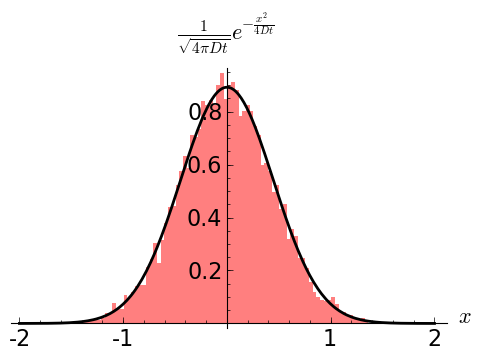
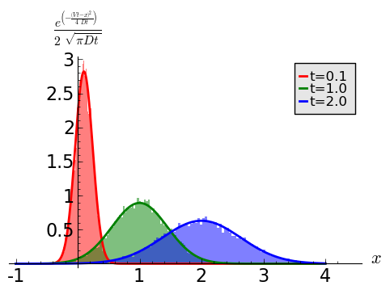

Przykłady całkowania procesów stochastycznych
=============================================

Proces dyfuzji
--------------

Jest to prawdopodobnie najprostszy proces stochastyczny wykorzystujący biały szum
gaussowski jako proces losowy. Przez matematyków nazywany jest po prostu procesem
Wienera ponieważ prawa strona równania ruchu zawiera tylko i wyłącznie ów proces.
Z drugiej strony jest obok procesu Poissona najważniejszym procesem losowym
na bazie którego można zdefiniować całą rodzinę procesów losowych o ciągłych
realizacjach. Równanie to można przedstawić używając równania Ito

.. math::

   d x(t) = \sqrt{2 D} dW(t).

Realizacja jest funkcją ciągłą, ale nigdzie nieróżniczkowalną (jako że pochodna
procesu Wienera nie istnieje). Za pomocą znanego już schematu Eulera-Maruyamy (EM)
możemy sobie wygenerować pojedynczą realizację takiego procesu. Parametr :math:`D`
reguluje natężenie szumu.

.. math::
  
   x_0 = 0

   x_{i+1} = x_i + \sqrt{2 h D} N(0,1).

Wiemy, że dla
procesu Wienera :math:`W(0) = 0`, wystartujemy więc z :math:`x(0) = 0`. Weźmy
krok :math:`h=0.01` i 5000 kroków czasowych. Dla przejrzystości weźmiemy 
natężenie szumu :math:`D=1`. Jako, że wiemy jak generować zmienne z rozkładem
`N(0,1)` użyjemy sobie "symbolicznego" oznaczenia na funkcję zwracajacą
takie zmienne. Funkcję taką nazwiemy ``std_norm``. Konkretna realizacja 
takiej funkcji może odbywać np: poprzez algorytm Boxa-Mullera. Funkcja ta
będzie przy wywołaniu zwracała jedną liczbę losową z `N(0,1)`.

.. code-block:: python

   h = 0.01
   N = 5000
   x0 = 0
   D = 1

   x = [x0]
   for i in xrange(1,N):
     n01 = std_norm()
     x.append(x[i-1] + sqrt(2*h*D) * n01)

Teraz narysujmy sobie takie realizacje dla kilku różnych wartości parametru `D`.

.. figure:: images/05/dyf02.png 
  :alt: Proces dyfuzji dla kilku różnych wartości parametru D.
  :align: center

  Proces dyfuzji dla kilku różnych wartości parametru D.

Na pierwszy rzut oka trajektorie (czy realizacje, przebiegi...) wyglądają kompletnie 
inaczej. Dla małych wartości `D` krzywe są bardziej regularne niż dla tych
parametryzowanych przez większe wartości `D`, dla których to wykres jest mocno
poszarpany i nieregularny. Jeżeli jednak narysowalibyśmy je osobno, nie oznaczając
osi, identyfikacja byłaby niemożliwa - nie widzimy bowiem relacji pomiędzy 
wartościami (przyrostami).

.. figure:: images/05/dyf.png 
  :alt: Proces dyfuzji dla kilku różnych wartości parametru D.
  :align: center

  Proces dyfuzji dla kilku różnych wartości parametru D. Są to te same przebiegi co
  w poprzednim wykresie. Kolory tu uzyte odpowiadają kolorom z wykresu poprzedniego.

Jako, że rozwiązanie równania dyfuzji znane jest od dawoen dawna, możemy potestować
na ile dokładnie rozwiązujemy nasze równanie. Oczywiście jedyne co możemy określić, 
to rozkład gęstości prawdopodobieństwa. Zakładając warunki początkowe

.. math::

   P(x,0) = \delta (x)

co oznacza, że cały zespół cząstek podlegających dyfuzji wystartuje z :math:`x(0)=0`,
możemy podać odpowiedź, bazując na równaniu dyfuzji

.. math::

   \frac{\partial P(x,t)}{\partial t} = D\frac{\partial^2 P(x,t)}{\partial x^2}.

Wynikiem jest rozkład Gaussa postaci

.. math::

   P(x,t) = \frac{1}{\sqrt{4 \pi D t}} \exp \Big[ -\frac{x^2}{4 D t} \Big].

w którym wariancja rośnie liniowo z czasem a średnia jest równa zero. Zobaczmy, czy jesteśmy w
stanie zweryfikować powyższy wzór numerycznie. Postaramy się znaleźć histogram
pozycji 10000 cząstek po 100 krokach i porównamy go z powyższym wynikiem. Założymy sobie
:math:`D=0.1` i krok czasowy :math:`h=0.01`. Oznacza to, że po 100 krokach symulacji
osiągniemy rzeczywisty czas równy 1.

  Proces dyfuzji po 100 krokach symulacji dla :math:`D=0.1`, :math:`h=0.01`, :math:`N=100`
  a co za tym idzie :math:`t=Nh`.

Zadanie 6.1.1
  Wykonaj w Sage powyższy rysunek. Metodę generowania histogramów znajdziesz w pierwszej
  części skryptu. Listę położeń, którą należy podać do histogramu wygeneruj w podobny
  sposób jak na początku tego rozdziału.

Dyfuzja ze stałym dryftem
-------------------------
Proces taki otrzymuje się bezpośrednio jako graniczny przypadek niesymetrycznego błądzenia
przypadkowego (polecam poczytać `ten podrozdział 
<http://el.us.edu.pl/ekonofizyka/index.php/PIZL:Proces_Wienera_i_proces_dyfuzji#Przypadek_niesymetryczny:_dyfuzja_z_dryfem>`_).
Równanie opisujące ten proces ma postać zbliżoną do poprzedniego, bogatsze jest jednak
o dodatkowy czynnik, zwany dryftem

.. math::

   \frac{\partial P(x,t)}{\partial t} = -V\frac{\partial P(x,t)}{\partial x} + D\frac{\partial^2 P(x,t)}{\partial x^2}.

Rozwiązaniem równania dyfuzji z dryfem, z takim samym warunkiem początkowym jak poprzednio 
(wszystkie cząstki, bądź realizacje zaczynają z tego samego położenia :math:`x(0)=0`
jest następujaca funkcja

.. math::

   P(x,t) = \frac{1}{\sqrt{4 \pi D t}} \exp \Big[ -\frac{(x - Vt)^2}{4 D t} \Big].

Jest to funkcja Gaussa opisujaca zmienne losowe normalne, a dwa pierwsze momenty wynoszą
odpowiednio :math:`\xi(t) = Vt` oraz :math:`\sigma_{\xi}^2 = 2 D t`. Łatwo zauważyć, że
zarówno średnia jak i wariancja zależne są liniowo od czasu. Ponadto wariancja jest 
identyczna jak w procesie dyfuzji bez dryftu. Dryft ów stały można z punktu widzenia fizyki
rozumieć jako stałą siłę przyłożoną do cząstki (coś na kształt cząstki umieszczonej na 
równi pochyłej) - położenie cząstki rośnie liniowo z czasem (jak w ruchu jednostajnie
prostoliniowym), ale fluktuacje rosną w czasie jak pierwiastek :math:`\sqrt{t}`.

Podobną analizę numeryczną jak poprzednio możemy przeprowadzić i tutaj. Tym razem, wykreślimy
sobie stroboskopowo histogram położeń po kilku krokach: `N = 10, 100, 200`. Po lekkiej
modyfikacji numeryczny schemat EM będzie wyglądał tak

.. code-block:: python

   h = 0.01
   N = 5000
   x0 = 0
   V = 1
   D = 1

   x = [x0]
   for i in xrange(1,N):
     n01 = std_norm()
     x.append(x[i-1] + V*h + sqrt(2*h*D) * n01)

Teraz wystarczy zobaczyć, czy histogramy położeń po czasie `t=0.1, 1, 2` będą odpowiadały
obliczonej powyżej funkcji rozkładu.

  Proces dyfuzji ze stałym dryftem po 10, 100 i 200 krokach symulacji dla :math:`D=0.1`, 
  :math:`h=0.01`, a co za tym idzie :math:`t=0.1, 1, 2`.

Możemy policzyć sobie teraz średnie, odchylenie standardowe oraz błędy względny i bezwzględny 
przybliżeń dokładnych rozwiązań procesu dyfuzji z dryftem.

+-----+-------+------+---------+-----------+---------------+
|czas |       |teoria|symulacje|:math:`E_b`|:math:`E_w` [%]|
+=====+=======+======+=========+===========+===============+
|     |średnia|0.10  |0.09972  |0.0002766  |0.2766         |
|t=0.1+-------+------+---------+-----------+---------------+
|     |std    |0.1414|0.1413   |0.00007544 |0.05335        |
+-----+-------+------+---------+-----------+---------------+
|t=1  |średnia|1.0   |1.005    |0.005345   |0.5345         |
|     +-------+------+---------+-----------+---------------+
|     |std    |0.4472|0.444    |0.003026   |0.6766         |
+-----+-------+------+---------+-----------+---------------+
|t=2  |średnia|2.0   |2.001    |0.001460   |0.07302        |
|     +-------+------+---------+-----------+---------------+
|     |std    |0.6324|0.6362   |0.003708   |0.5863         |
+-----+-------+------+---------+-----------+---------------+

Jak widzimy błędy bezwzględne dochodzą do około pół punktu procentowego różnicy dla 10000 
realizacji. Zwiekszenie próby spowoduje jeszcze lepsze dopasowanie, zmniejszenie spowoduje
większe odchylenia od wartości rzeczywistych.

Zadanie 6.1.2
  Oblicz błędy przybliżenia rozwiazania problemu dyfuzji ze stałym dryftem dla 10, 100, 500 i
  1000 różnych realizacji. Zestawienia podaj w tabeli.

.. Proces Ornsteina-Uhlenbecka
.. ---------------------------

.. Równanie Blacka-Scholesa
.. ------------------------

